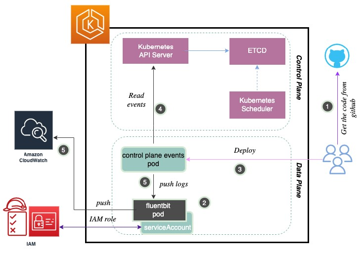

# Managing Amazon EKS control plane events


## Context

Currently EKS event TTL is set to 60m. Some customers have shown interest to increase the TTL. (https://github.com/aws/containers-roadmap/issues/785). It will be an additional burden if EKS control plane provided the option to increase TTL as this will add load to ETCD and storage. This solution here tries to bridge the gap to capture events beyond 60 minutes to cloudwatch, if the customers still achieve the same. That way control plane event TTL is not modified but at the sametime, if customer wanted to capture the events beyond 60m, they could achieve the same.

## Prerequisites

- Working [DaemonSet](https://docs.aws.amazon.com/AmazonCloudWatch/latest/monitoring/Container-Insights-setup-logs-FluentBit.html) of Fluent bit that send logs to Cloudwatch logs
- Admin account in K8S

## Solution flow



## Helm

### Install chart

```
helm repo add eks-event-watcher https://i2btech.github.io/eks-event-watcher

helm repo update

helm \
    install \
    --create-namespace \
    --namespace eks-event-watcher \
    --version=X.Y.Z \
    eew-chart eks-event-watcher/eew
```

### Validate template in local

```
helm template eew-chart .
```

### Delete chart

```
helm delete eew-chart -n eks-event-watcher
```

## Links

- https://www.alibabacloud.com/blog/helm-charts-and-template-basics---part-2_595490


## TODO

- Improves Github actions
    - use `appVersion` in file Chart.yaml to set tag in docker hub image, we also need to keep the `latest` tag because it's used in the `Values.yaml` file
- Improves k8s templates
    - add option `resources` to control capacity used by pod
- Add logic to pass an existing service Account, in this case the service Account defined in the chart should not be created
